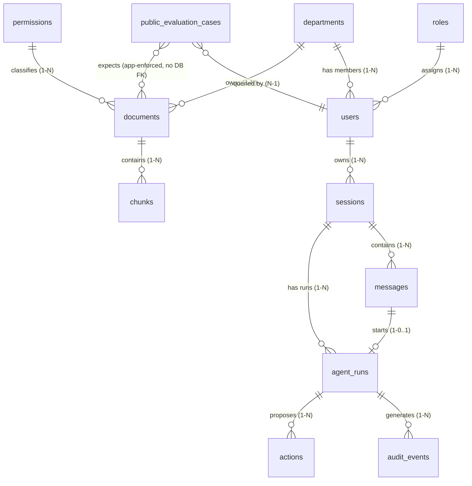

# Database Schema Design Report — My Tasco Secure Agentic RAG

This document outlines the relational PostgreSQL schema used to store the My Tasco synthetic enterprise knowledge dataset, fixed roles, permissions, chat data, and governance logs. Vector embeddings are intentionally out of scope for this implementation.

## 1. Entity-Relationship Diagram (ERD)

The entity relationships map directly to both the static dataset and the runtime application logs:



---

## 2. Table Specifications

### 2.1 Table: `departments`
Stores metadata regarding department/knowledge space relations.

| Column Name | Type | Constraints | Description | Source Sheet/Col |
|---|---|---|---|---|
| `id` | `UUID` | Primary Key | Internal database identifier | Generated (UUIDv4) |
| `department_id` | `VARCHAR(32)` | Unique, Not Null | Unique business key (e.g. `COMP`, `HR`, `FIN`) | `Departments.department_id` |
| `department_en` | `VARCHAR(128)` | Unique, Not Null | English department name (e.g. `Human Resources`) | `Departments.department_en` |
| `department_vi` | `VARCHAR(128)` | Not Null | Vietnamese department name (e.g. `Phòng Nhân sự`) | `Departments.department_vi` |
| `knowledge_space`| `VARCHAR(128)` | Not Null | Associated space description | `Departments.knowledge_space` |

### 2.2 Table: `roles`
Stores RBAC authorization rules per role.

| Column Name | Type | Constraints | Description | Source Sheet/Col |
|---|---|---|---|---|
| `id` | `UUID` | Primary Key | Internal database identifier | Generated (UUIDv4) |
| `role_en` | `VARCHAR(64)` | Unique, Not Null | English role name (e.g. `Employee`) | `Roles.role_en` |
| `role_vi` | `VARCHAR(64)` | Not Null | Vietnamese role name (e.g. `Nhân viên`) | `Roles.role_vi` |
| `company_knowledge`| `VARCHAR(32)` | Not Null | Access level to company data (`Yes`/`No`) | `Roles.company_knowledge` |
| `department_knowledge`| `VARCHAR(32)` | Not Null | Access level to department data | `Roles.department_knowledge` |
| `executive_knowledge`| `VARCHAR(32)` | Not Null | Access level to executive data | `Roles.executive_knowledge` |

### 2.3 Table: `permissions`
Authoritative reference/seed for the classification × role rules. **Not queried at retrieval time** — the runtime access filter uses `documents.allowed_access` (see §5). Kept for documentation, seeding, and audit.

| Column Name | Type | Constraints | Description | Source Sheet/Col |
|---|---|---|---|---|
| `id` | `UUID` | Primary Key | Internal database identifier | Generated (UUIDv4) |
| `classification` | `VARCHAR(32)` | Unique, Not Null | Target classification level (e.g. `Confidential`) | `Permissions.classification` |
| `employee` | `VARCHAR(32)` | Not Null | Rule for Employee role (`Allow`, `Deny`, `Own Department`) | `Permissions.employee` |
| `manager` | `VARCHAR(32)` | Not Null | Rule for Manager role | `Permissions.manager` |
| `director` | `VARCHAR(32)` | Not Null | Rule for Director role | `Permissions.director` |
| `executive` | `VARCHAR(32)` | Not Null | Rule for Executive role | `Permissions.executive` |
| `rule_description_vi`| `TEXT` | Not Null | Vietnamese rule description | `Permissions.rule_description_vi` |

### 2.4 Table: `users`
Stores synthetic employees for authorization and persona switching.

| Column Name | Type | Constraints | Description | Source Sheet/Col |
|---|---|---|---|---|
| `id` | `UUID` | Primary Key | Internal database identifier | Generated (UUIDv4) |
| `user_id` | `VARCHAR(32)` | Unique, Not Null | Business user key (e.g., `U001`) | `Users.user_id` |
| `full_name` | `VARCHAR(200)` | Not Null | Employee full name | `Users.full_name` |
| `department_id` | `VARCHAR(32)` | Foreign Key (`departments.department_id`), Index | Linked department | `Users.department` (normalized to `department_id` e.g., `HR`) |
| `role_en` | `VARCHAR(64)` | Foreign Key (`roles.role_en`), Index | Linked role | `Users.role` |
| `email` | `VARCHAR(255)` | Unique, Not Null | Employee email address | `Users.email` |
| `status` | `VARCHAR(32)` | Not Null, Default 'Active' | Account status (`Active`, `Inactive`) | `Users.status` |

### 2.5 Table: `documents`
Stores document content and metadata merged from the `Documents` and `Document_Metadata` sheets.

| Column Name | Type | Constraints | Description | Source Sheet/Col |
|---|---|---|---|---|
| `id` | `UUID` | Primary Key | Internal database identifier | Generated (UUIDv4) |
| `document_id` | `VARCHAR(32)` | Unique, Not Null | Unique business document key (e.g., `DOC001`) | `Documents.document_id` |
| `title` | `VARCHAR(300)` | Not Null | Document Title | `Documents.title` |
| `department_id` | `VARCHAR(32)` | Foreign Key (`departments.department_id`), Index | Owning department | `Documents.department` (normalized e.g., `HR`) |
| `classification` | `VARCHAR(32)` | Foreign Key (`permissions.classification`), Index | Classification level | `Documents.classification` |
| `owner` | `VARCHAR(128)` | Not Null | Owner entity | `Document_Metadata.owner` |
| `allowed_access` | `VARCHAR(32)` | Generated Always As (Stored), Not Null | Derived from `classification` (Public→All, Internal→All Employees, Confidential→Own Department, Restricted→Executive Only) — single source = classification, cannot drift; used by the retrieval filter (§5) | Derived from `classification` |
| `last_updated` | `DATE` | Not Null | Last update timestamp | `Document_Metadata.last_updated` |
| `tags` | `JSONB` | Not Null | List of search tags (JSON array) | `Document_Metadata.tags` (split by `,`) |
| `language` | `VARCHAR(16)` | Not Null, Default 'vi' | Document language code | `Document_Metadata.language` |
| `word_count` | `INTEGER` | Not Null | Length of the document in words | `Document_Metadata.word_count` |
| `content` | `TEXT` | Not Null | Full document content in markdown | `Documents.content_vi` |
| `status` | `VARCHAR(32)` | Not Null, Default 'Active' | Document status (`Active`, `Archived`) | Derived |
| `created_at` | `TIMESTAMPTZ` | Default `NOW()` | Audit creation time | System |
| `updated_at` | `TIMESTAMPTZ` | Default `NOW()` | Audit update time (bumped on content/metadata change) | System |

### 2.6 Table: `chunks`
Stores ordered text segments parsed from documents. Embeddings and vector indexes are not part of the current implementation.

| Column Name | Type | Constraints | Description | Source |
|---|---|---|---|---|
| `id` | `UUID` | Primary Key | Internal database identifier | Generated (UUIDv4) |
| `document_id` | `UUID` | Foreign Key (`documents.id`), Index | References owning document | System |
| `chunk_index` | `INTEGER` | Not Null, Unique with `document_id` | Stable order within the current document | Parser |
| `section` | `VARCHAR(256)` | Not Null | Heading hierarchy path (e.g. `3.1. Probation`) | Parsed from markdown |
| `content` | `TEXT` | Not Null | Text segment content | Parsed from markdown |
| `created_at` | `TIMESTAMPTZ` | Default `NOW()` | Audit creation time | System |

### 2.7 Table: `public_evaluation_cases`
Stores the 50 test cases used to validate RAG accuracy and permission matrices.

| Column Name | Type | Constraints | Description | Source Sheet/Col |
|---|---|---|---|---|
| `id` | `UUID` | Primary Key | Internal database identifier | Generated (UUIDv4) |
| `question_id` | `VARCHAR(32)` | Unique, Not Null | Question key (e.g., `P001`) | `Public_Evaluation.question_id` |
| `category` | `VARCHAR(64)` | Not Null | Query domain category | `Public_Evaluation.category` |
| `user_id` | `VARCHAR(32)` | Foreign Key (`users.user_id`), Index | Persona user ID querying | `Public_Evaluation.user_id` |
| `question` | `TEXT` | Not Null | Query question text in Vietnamese | `Public_Evaluation.question_vi` |
| `expected_permission`| `VARCHAR(32)` | Not Null | Expected outcome (`Allow`, `Deny`) | `Public_Evaluation.expected_permission` |
| `expected_document_ids`| `JSONB` | Not Null | Array of expected document keys (e.g., `["DOC001"]`) | `Public_Evaluation.expected_document_id` (split by `;`) |
| `answer_type` | `VARCHAR(32)` | Not Null | Evaluation answer type | `Public_Evaluation.answer_type` |
| `difficulty` | `VARCHAR(32)` | Not Null | Level of query difficulty | `Public_Evaluation.difficulty` |

---

## 3. Runtime & Governance Schema (App Logs)

These tables track sessions, active runs of the agent state machine, confirmed actions, and secure audit events.

### 3.1 Table: `sessions`
Tracks active user chat sessions.

| Column Name | Type | Constraints | Description |
|---|---|---|---|
| `id` | `UUID` | Primary Key | Session identifier |
| `user_id` | `UUID` | Foreign Key (`users.id`), Nullable, Index | Authenticated user; NULL for anonymous sessions |
| `principal_type` | `VARCHAR(16)` | Not Null, Default `ANONYMOUS`, Check | `ANONYMOUS` or `USER`; must agree with nullability of `user_id` |
| `status` | `VARCHAR(16)` | Not Null, Default `ACTIVE`, Check | `ACTIVE`, `EXPIRED`, or `REVOKED` |
| `locale` | `VARCHAR(32)` | Not Null, Default 'vi-VN' | Client language preference |
| `title` | `VARCHAR(200)` | Nullable | Automatically generated topic title |
| `expires_at` | `TIMESTAMPTZ` | Not Null | Session expiry timestamp |
| `created_at` | `TIMESTAMPTZ` | Default `NOW()` | Creation timestamp |
| `updated_at` | `TIMESTAMPTZ` | Default `NOW()` | Last session update timestamp |

### 3.2 Table: `messages`
Stores the exact user, assistant, and system messages associated with a session. Chain-of-thought is never stored.

| Column Name | Type | Constraints | Description |
|---|---|---|---|
| `id` | `UUID` | Primary Key | Message identifier |
| `session_id` | `UUID` | Foreign Key (`sessions.id`) ON DELETE CASCADE, Not Null, Index | Owning session |
| `role` | `VARCHAR(16)` | Not Null, Check | `USER`, `ASSISTANT`, or `SYSTEM` |
| `content` | `TEXT` | Not Null | Persisted message content |
| `client_request_id` | `UUID` | Nullable, Unique | Client retry identifier for user messages |
| `created_at` | `TIMESTAMPTZ` | Default `NOW()` | Creation timestamp |

### 3.3 Table: `agent_runs`
Tracks state machine iterations, final answers, claims, and citation mappings.

| Column Name | Type | Constraints | Description |
|---|---|---|---|
| `id` | `UUID` | Primary Key | Run identifier |
| `session_id` | `UUID` | Foreign Key (`sessions.id`) ON DELETE CASCADE, Not Null, Index | Chat session linkage |
| `input_message_id` | `UUID` | Foreign Key (`messages.id`), Not Null, Unique | User message that started the run |
| `trace_id` | `UUID` | Not Null | OpenTelemetry trace identifier |
| `idempotency_key` | `VARCHAR(128)` | Not Null, Unique | Prevents duplicate run creation |
| `status` | `VARCHAR(64)` | Not Null, Default 'RECEIVED' | State machine status (e.g., `COMPLETED`, `DENIED`) |
| `route` | `VARCHAR(64)` | Nullable | Execution route (`DETERMINISTIC`, `SIMPLE_RAG`, `AGENTIC_READ`, `CONFIRMED_ACTION`) |
| `answer` | `TEXT` | Nullable | Grounded answer text returned to client |
| `claims` | `JSONB` | Nullable | JSON array of extracted claims with source references |
| `citations` | `JSONB` | Nullable | JSON array of approved citation details |
| `created_at` | `TIMESTAMPTZ` | Default `NOW()` | Run start timestamp |
| `updated_at` | `TIMESTAMPTZ` | Default `NOW()` | Run transition update timestamp |

### 3.4 Table: `actions`
Stores action drafts waiting for explicit user confirmation.

| Column Name | Type | Constraints | Description |
|---|---|---|---|
| `id` | `UUID` | Primary Key | Action identifier |
| `agent_run_id` | `UUID` | Foreign Key (`agent_runs.id`), Not Null, Index | Run that proposed this action (binds action → session → user) |
| `action_type` | `VARCHAR(128)` | Not Null | Identifier of the tool (e.g. `request_submit_confirmed`) |
| `status` | `VARCHAR(64)` | Not Null, Default 'DRAFT' | Action state (`DRAFT`, `WAITING_CONFIRMATION`, `CONFIRMED`, `EXECUTING`, `COMPLETED`, `REJECTED`, `EXPIRED`, `FAILED`) |
| `summary` | `TEXT` | Not Null | Human-readable explanation of predicted impact |
| `parameters` | `JSONB` | Not Null, Default `{}` | Exact parameters proposed |
| `confirmation_token_hash`| `VARCHAR(64)`| Nullable, Unique | SHA-256 hash of the single-use token; bound through the action to its run/session/user |
| `idempotency_key` | `VARCHAR(128)` | Nullable, Unique | Confirmation request that consumed the action |
| `expires_at` | `TIMESTAMPTZ` | Not Null | Token expiry — mandatory so confirmation tokens cannot stay valid indefinitely |
| `consumed_at` | `TIMESTAMPTZ` | Nullable | Set atomically on confirmation or rejection |
| `created_at` | `TIMESTAMPTZ` | Default `NOW()` | Creation timestamp |
| `updated_at` | `TIMESTAMPTZ` | Default `NOW()` | Last state transition timestamp |

### 3.5 Table: `audit_events`
Stores tamper-evident content-free system event logs.

The implementation also maintains one internal `audit_chain_state` row. The insert trigger locks this row with `FOR UPDATE`, reads the latest hash, appends the event, and advances the stored hash in the same transaction so concurrent inserts cannot fork the chain.

| Column Name | Type | Constraints | Description |
|---|---|---|---|
| `id` | `UUID` | Primary Key | Event identifier |
| `sequence_no` | `BIGINT` | Trigger-assigned, Unique | Database ordering assigned after locking the chain state row |
| `run_id` | `UUID` | Foreign Key (`agent_runs.id`) ON DELETE SET NULL, Nullable, Index | Originating run (nullable for system-level events; retained when a run/session is deleted) |
| `event_type` | `VARCHAR(128)` | Not Null | Category (e.g. `RETRIEVAL_ACCESSED`, `ACTION_EXECUTED`) |
| `actor_user_id` | `UUID` | Foreign Key (`users.id`), Nullable, Index | Subject user (typed FK, replaces free-text `actor_id`) |
| `request_id` | `VARCHAR(64)` | Nullable, Index | HTTP Request ID |
| `payload` | `JSONB` | Not Null, Default `{}` | Content-free metadata context |
| `prev_hash` | `VARCHAR(64)` | Nullable | `entry_hash` of the previous event (hash-chain; NULL only for the first row) |
| `entry_hash` | `VARCHAR(64)` | Not Null | SHA-256 over (`prev_hash` + canonical event fields) — makes the log tamper-evident |
| `created_at` | `TIMESTAMPTZ` | Default `NOW()` | Log timestamp |

---

## 4. Data Integrity & Normalization Rules

1. **Relational Constraints**:
   - Both `users.department_id` and `documents.department_id` reference `departments.department_id` directly to eliminate discrepancies (such as standardizing `HR` vs `Human Resources` in Excel).
   - `users.role_en` references `roles.role_en` to dynamically map company/department/executive retrieval scopes.
   - `documents.classification` references `permissions.classification` (classification master). `documents.allowed_access` is a generated column derived from `classification` and is the field the retrieval filter reads (§5) — this keeps a single source of truth for access.
2. **Cascading Actions**:
   - On `document` update: bump `updated_at` and regenerate its ordered text `chunks`. The schema keeps a single current version per document; if full version history is later required, add a dedicated `document_versions` table rather than overloading `documents`.
   - Deleting a `session` cascade-deletes its `messages`, `agent_runs`, and `actions`. `audit_events` are append-only and retained: their `run_id` FK is `ON DELETE SET NULL`, so events survive run/session deletion for compliance.
3. **Tamper-evident audit log**:
   - `audit_events` is append-only at the database layer. Inserts are serialized, `sequence_no` defines ordering, and a trigger computes `entry_hash = SHA-256(prev_hash || canonical fields)`. An external checkpoint is still required if detection of privileged tail deletion becomes a compliance requirement.
4. **Evaluation references**:
   - `public_evaluation_cases.expected_document_ids` is a JSONB array of business keys (e.g. `["DOC001","DOC011"]`) with no DB-level FK. The loader must validate every ID exists in `documents` at ingest and fail fast on dangling references.

---

## 5. Access Control & Retrieval Filter

Access is decided by a **single source of truth**: `documents.classification` and its generated `allowed_access`. The `permissions` matrix (§2.3) is only the reference/seed for the classification × role rules — it is **not** queried at retrieval time.

### 5.1 Resolution flow

1. Runtime resolves the session principal. `ANONYMOUS` has no user row. `USER` resolves `sessions.user_id` and requires `users.status = 'Active'` before loading department and role.
2. Pre-filter `documents` with the rule below **before** any content reaches the model (metadata filter first, not post-generation).
3. Apply ordinary relational/text retrieval to the surviving documents or chunks. Semantic vector ranking is a later phase.

### 5.2 Filter rule (by `allowed_access`)

| `allowed_access` | Access granted when |
|---|---|
| `All` | always, including anonymous callers (Public) |
| `All Employees` | authenticated user with `status = 'Active'` |
| `Own Department` | `documents.department_id = users.department_id` **OR** `users.role_en = 'Executive'` |
| `Executive Only` | `users.role_en = 'Executive'` |

> The `OR users.role_en = 'Executive'` branch on `Own Department` is mandatory: the `permissions` matrix grants Executive `Allow` on all Confidential documents (executive_knowledge = All Departments). Omitting it wrongly denies an Executive reading another department's Confidential document — a case the public evaluation set does not cover but the rule requires.

### 5.3 Reference query

```sql
SELECT d.*
FROM documents d
WHERE d.status = 'Active' AND (
       d.allowed_access = 'All'
    OR (
         :user_id IS NOT NULL
         AND :user_status = 'Active'
         AND (
              d.allowed_access = 'All Employees'
           OR (d.allowed_access = 'Own Department'
                 AND (d.department_id = :user_department_id OR :user_role = 'Executive'))
           OR (d.allowed_access = 'Executive Only' AND :user_role = 'Executive')
         )
       )
);
```

For anonymous sessions all user parameters are NULL, so only Public rows survive. Authenticated parameters come from the active `users` row resolved via `sessions.user_id`.

Anonymous sessions are read-only. Action preview, confirmation, rejection, and execution require an authenticated active `USER` session.
